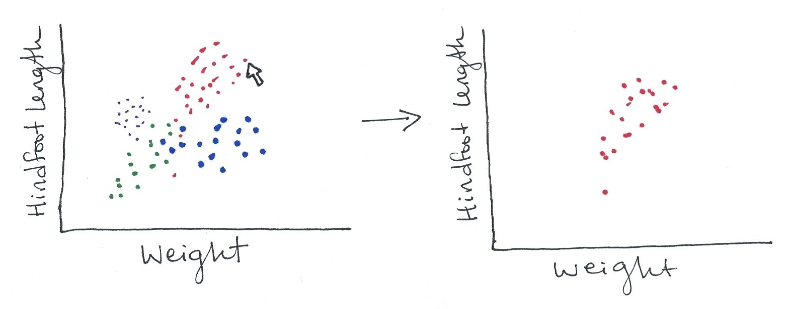

# Assignment 3 storyboard

I will be using the
[Portal Project Teaching Database](https://figshare.com/articles/Portal_Project_Teaching_Database/1314459)
to develop an interactive visualization for the domain of ecology. This dataset
emerged from a long-term (1977-2002) monitoring project near Portal, Arizona,
during which researchers conducted experimental manipulations of rodent, ant,
and plant communities (Ernest et al., 2009). The rodent data from this project
has been simplified to create a database designed for teaching (Ernest et al.,
2015). This data, which contains weight and hindfoot length measurements for a
number of rodents and other animals from the experimental plots, is what I'll
use for this project.

This visualization will address questions about the biology of species in the
data set, and specifically about different species' physical characteristics.
The first image will be a scatterplot of hindfoot length vs. weight with points
colored by genus. Since each species will have its own typical body shape and
size range, these points will likely cluster into groups with some overlap.

I will implement details on demand in the form of tooltips to show users the
genus and species, date of the observation, and the enclosure type.

The Portal database contains over 34,000 observations, so the details on demand
will only be useful after filtering the data down using dynamic queries. It will
be relevant to compare the data from different types of enclosures and different
sexes, as well as to provide a date range slider.

Finally, to let users look more closely at a particular genus, I'll (hopefully)
implement generalized selection so that a user can click a single point to view
all the points from that genus.

## References

Ernest, S. K. M., Brown, J.; Valone, T.; White, E. P. (2015). Portal Project Teaching Database. *figshare*. [https://dx.doi.org/10.6084/m9.figshare.1314459.v5](https://dx.doi.org/10.6084/m9.figshare.1314459.v5)

Ernest, S. K. M., Valone, T. J., & Brown, J. H. (2009). Long-term monitoring and experimental manipulation of a Chihuahuan Desert ecosystem near Portal, Arizona, USA. *Ecology, 90*(6), 1708-1708. [http://doi.org/10.1890/08-1222.1](http://doi.org/10.1890/08-1222.1)
