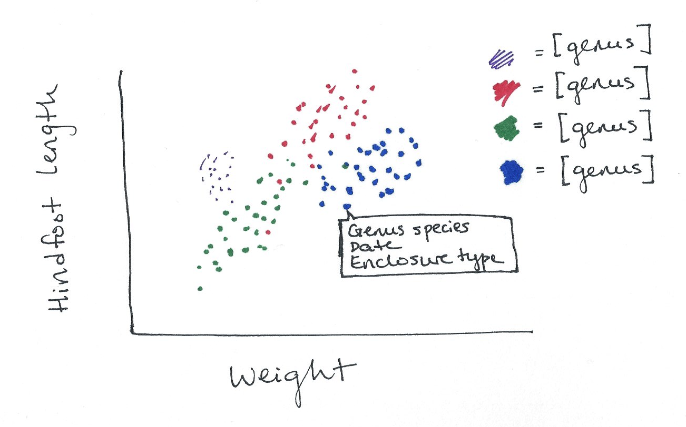
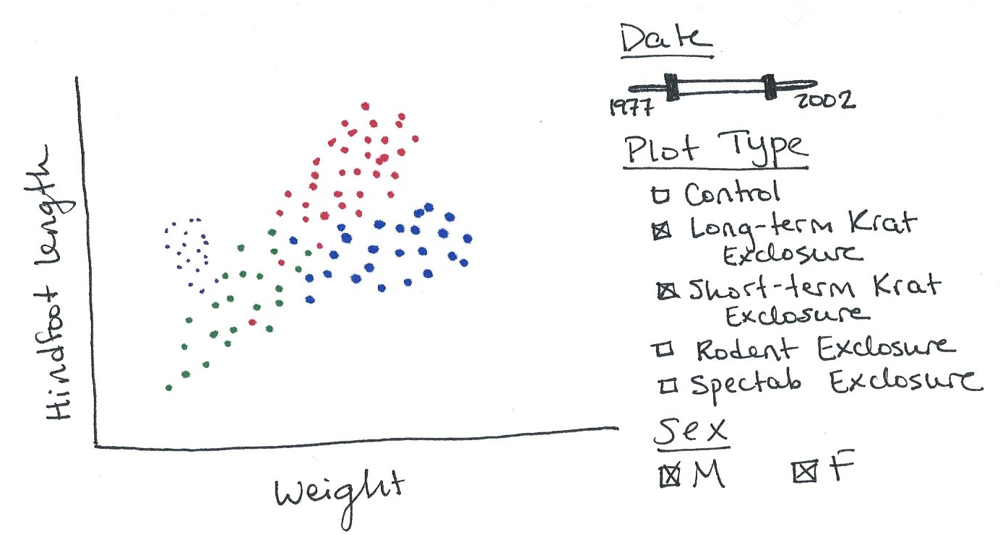
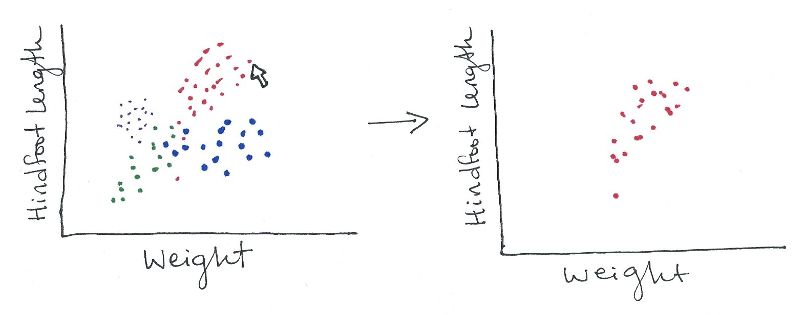
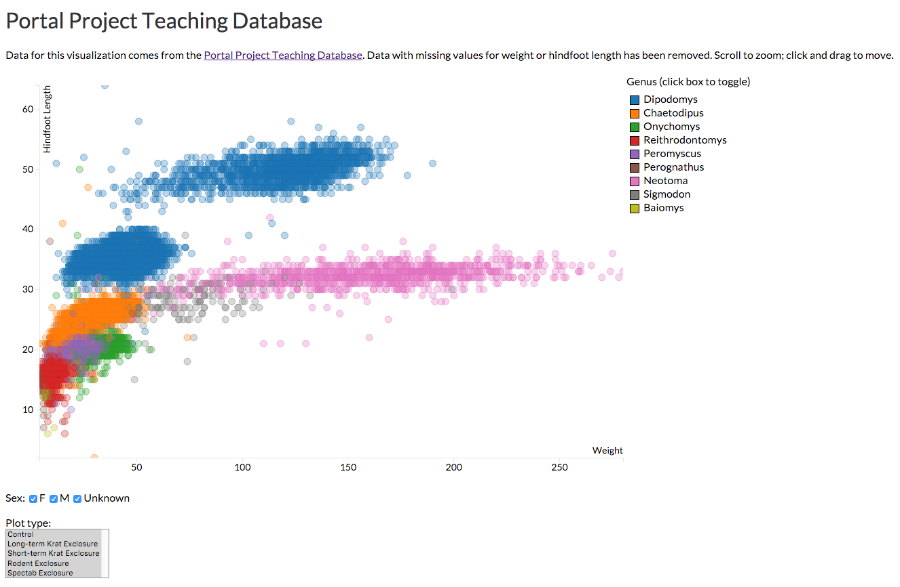

# Assignment 3: Creating Interactive Visualization Software

Kara Woo

17 February 2016

## Storyboard

I will be using the
[Portal Project Teaching Database](https://figshare.com/articles/Portal_Project_Teaching_Database/1314459)
to develop an interactive visualization for the domain of ecology. This dataset
emerged from a long-term (1977-2002) monitoring project near Portal, Arizona,
during which researchers conducted experimental manipulations of rodent, ant,
and plant communities (Ernest et al., 2009). The rodent data from this project
has been simplified to create a database designed for teaching (Ernest et al.,
2015). This data, which contains weight and hindfoot length measurements for a
number of rodents and other animals from the experimental plots, is what I'll
use for this project.

This visualization will address questions about the biology of species in the
data set, and specifically about different species' physical characteristics.
The first image will be a scatterplot of hindfoot length vs. weight with points
colored by genus. Since each species will have its own typical body shape and
size range, these points will likely cluster into groups with some overlap.

I will implement details on demand in the form of tooltips to show users the
genus and species, date of the observation, and the enclosure type.

The Portal database contains over 34,000 observations, so the details on demand
will only be useful after filtering the data down using dynamic queries. It will
be relevant to compare the data from different types of enclosures and different
sexes, as well as to provide a date range slider.

Finally, to let users look more closely at a particular genus, I'll (hopefully)
implement generalized selection so that a user can click a single point to view
all the points from that genus.

## Final visualization

The final visualization is an interactive scatter plot of animals' weight and
hindfoot length with points colored by genus. Users can filter the data by sex
using checkboxes, by enclosure type using a multiselect menu, and by genus using
the interactive legend. In addition, they can scroll to zoom in on the data and
click and drag to move the image and view different areas of the graph. Tooltips
provide information on the species, date, and enclosure type of each point.

The final visualization is shown below and is available at
[http://karawoo.com/INFX-598J-assignment-3/portal.html](http://karawoo.com/INFX-598J-assignment-3/portal.html).

I made several changes from the original storyboard ideas, one of which was
abandoning the date filter slider. I tried multiple approaches but was never
able to get the slider to properly filter the data. In the end I decided date
filtering was less important than some of the other interactions I wanted to
implement, so I opted to focus on those.

To show all the points of a single genus, I chose to use the legend boxes to
filter the data rather than having users click on points to highlight a single
genus. This allows users to view any combination of genera at the same time
without having to constantly revert the graph before changing views.

I added the panning and zooming feature when I realized just how cluttered
30,000 data points really is. Making the points semi-transparent helped a little
with overplotting, but it was still hard to see what was going on, particularly
in the bottom left corner. The zooming feature helps, although some groups of
points are so tightly clustered that it is still impossible to get a sense for
how many points there really are. The genus Reithrodontomys, for example, is
quite a bit more abundant than Neotoma, but it is quite difficult to tell that
this is the case by looking at the visualization. 

There are a few features I would have liked to implement but did not have time
for. It would be useful to allow the user to restore the original graph after
they have zoomed or moved it. Right now, the only way to do this is to refresh
the page. I would also like to make the legend more obviously interactive, i.e.
with more button-looking buttons. Currently the panning and zooming is very
slow, which I believe is a consequence of the number of data points. I would
like to find a way to optimize this visualization and improve its
responsiveness.

## Development process

Creating this visualization from the storyboarding process to the final product
took 32.5 hours, most of which was spent in either dire frustration or extreme
elation. This was my first experience with JavaScript and D3, and I learned a
lot by working on this project. Manipulating the data was a big limitation, and
I ended up doing some initial data cleaning in R. I spent a lot of time reading
examples online and in *Interactive Data Visualization for the Web* (Murray,
2013) and trying to understand how to apply them to my project. Often I would
think I understood how to do something and then find that my approach did not
work at all, so I spent a lot of time on trial-and-error tweaking and trying to
understand why one thing worked when another did not. Making the various
features work together also took significant amount of time.

## References

Ernest, S. K. M., Brown, J.; Valone, T.; White, E. P. (2015). Portal Project Teaching Database. *figshare*. [https://dx.doi.org/10.6084/m9.figshare.1314459.v5](https://dx.doi.org/10.6084/m9.figshare.1314459.v5)

Ernest, S. K. M., Valone, T. J., & Brown, J. H. (2009). Long-term monitoring and experimental manipulation of a Chihuahuan Desert ecosystem near Portal, Arizona, USA. *Ecology, 90*(6), 1708-1708. [http://doi.org/10.1890/08-1222.1](http://doi.org/10.1890/08-1222.1)

Murray, S. (2013). *Interactive Data Visualization for the Web*. O’Reilly Media,
Inc.
